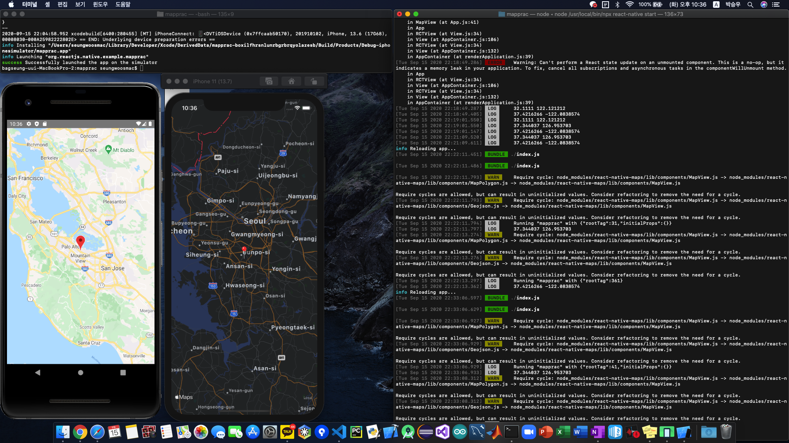

# react-native-maps usage

## Execution screen



---

## Source, more details

[react-native-maps](https://github.com/react-native-community/react-native-maps)

## How to use

> _This doc was written for RN version >= 0.60_
>
> - Install react-native-maps
>
> ```bash
>   npm install --save react-native-maps
> ```
>
> ### **For ios**
>
> - First, Move dir to ~/project/ios and run pod install
>
> ```bash
>   # in project dir
>
>   cd ios
>   pod install
>   cd ..
> ```
>
> - Second, use MapView
>
> ```javascript
>   import MapView from 'react-native-maps';
>   ...
>   <MapView />
>   ...
> ```
>
> It'll use the apple map

> ### **For android**
>
> - First, get google api key.
> - Second, open ~/project/android/app/src/main/AndroidManifest.xml file. <br/> And add these lines in application element
>
> ```xml
>   <application
>   ...>
>     ...
>     <meta-data
>     android:name="com.google.android.geo.API_KEY"
>     android:value="API_KEY" />
>     ...
>   </application>
> ```
>
> - Third, open ~/project/android/build.gradle file. <br/> And add these lines in ext
>
> ```gradle
>   buildscript {
>     ext {
>       ,,,
>       supportLibVersion = "28.0.0"
>       googlePlayServicesVersion = "17.0.0"
>       androidMapsUtilsVersion = "0.6.2"
>     }
>     ,,,
>   }
> ```
>
> - Fourth, use MapView
>
> ```javascript
>   import MapView from 'react-native-maps';
>   ...
>   <MapView />
>   ...
> ```
>
> It'll use the google map

# Geolocation usage

## Source, more details

[Geolocation](https://github.com/react-native-community/react-native-geolocation)

## How to use

> _This doc was written for RN version >= 0.60_
>
> - Install @react-native-community/geolocation
>
> ```bash
>   npm install @react-native-community/geolocation --save
> ```
>
> ### **For ios**
>
> - First, Move dir to ~/project/ios and run pod install
>
> ```bash
>   # in project dir
>
>   cd ios
>   pod install
>   cd ..
> ```
>
> - Second, open ~/project/ios/project_name/info.plist file. <br> And add these lines.
>
> ```xml
>   <dict>
>       ...
>       <key>NSLocationAlwaysAndWhenInUseUsageDescription</key>
>       <string>test</string>
>       <key>NSLocationAlwaysUsageDescription</key>
>       <string>test</string>
>       <key>NSLocationWhenInUseUsageDescription</key>
>       <string>test</string>
>       ...
>   </dict>
> ```
>
> - Third, set up the simulator
>
>   Go to simulator menubar -> features -> location <br> And click anything you want <br> then simulator may get its own location.
>
> - Third, and use it!
>
> ```javascript
>   import Geolocation from '@react-native-community/geolocation'
>   ...
>   Geolocation.getCurrentPosition(
>       position => console.log(position);
>   );
>   ...
> ```
>
> ### **For Android**
>
> - First, open ~/project/android/app/src/main/AndroidManifest.xml file. <br> And add this line in manifest element.
>
> ```xml
>   <manifest
>       ...>
>   ...
>   <uses-permission android:name="android.permission.ACCESS_FINE_LOCATION" />
>   ...
>   </manifest>
> ```
>
> - Second, and use it!
>
> ```javascript
>   import Geolocation from '@react-native-community/geolocation'
>   ...
>   Geolocation.getCurrentPosition(
>       position => console.log(position);
>   );
>   ...
> ```
